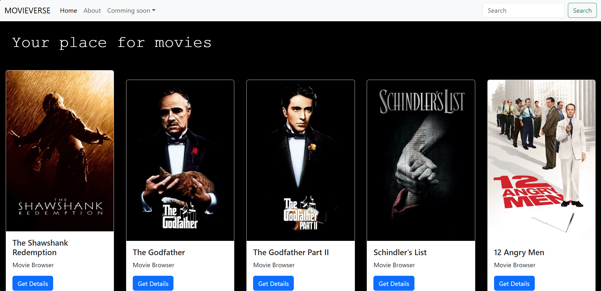
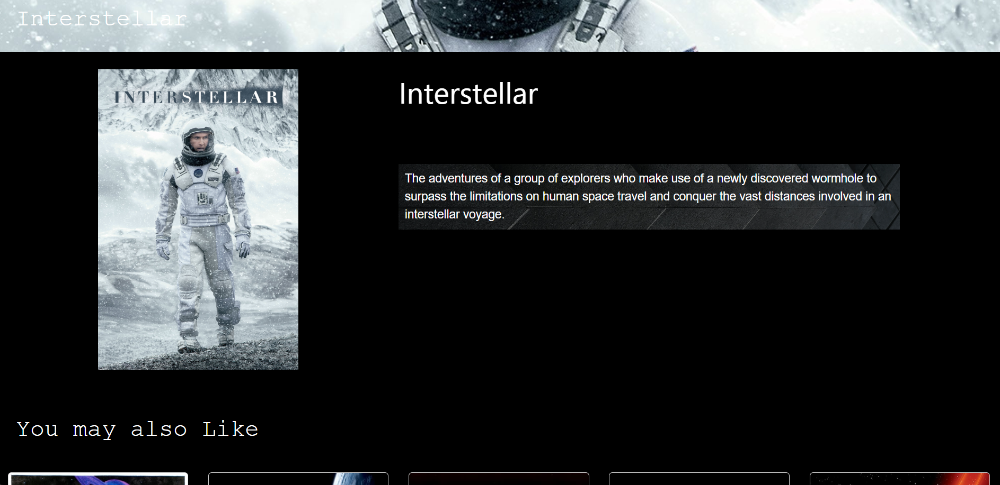
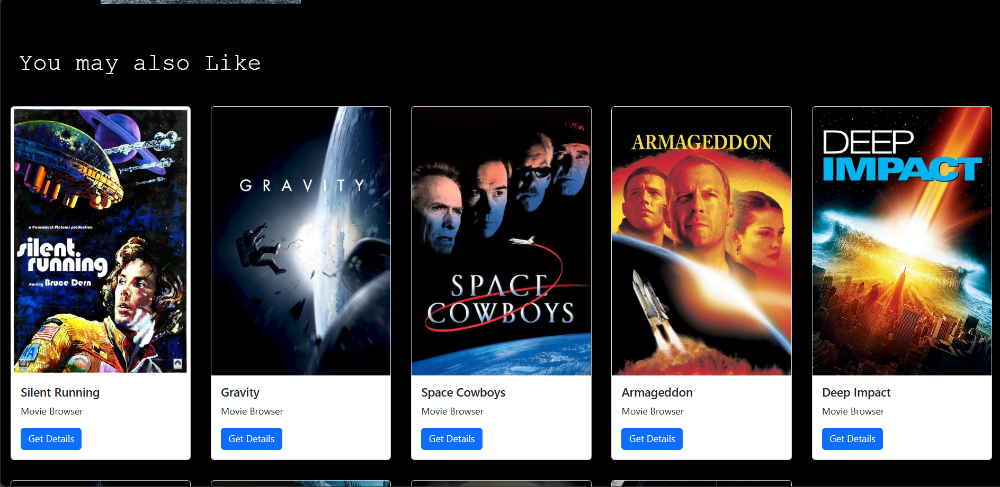

# Movie-recommendation



# Recommendation






Follow these steps to set up the project:

---

## Backend Setup (Django)

1. **Create a Virtual Environment**  
   ```bash
   python -m venv movie_reomender
   ```

2. **Clone the Repository**  
   Clone the project files **inside the virtual environment folder**:  
   ```bash
   git clone <repository-url>
   ```

3. **Activate the Virtual Environment**  
   On Windows:  
   ```bash
   movie_reomender\Scripts\activate
   ```  
   On macOS/Linux:  
   ```bash
   source movie_reomender/bin/activate
   ```

4. **Navigate to the Backend Folder**  
   ```bash
   cd movie_reomender
   cd backend
   ```

5. **Install Python Dependencies**  
   ```bash
   pip install -r requirements.txt
   ```

6. **Database Setup**  
   - Make migrations:  
     ```bash
     python manage.py makemigrations
     ```  
   - Apply migrations:  
     ```bash
     python manage.py migrate
     ```

8. **Run the Django Server**  
   ```bash
   python manage.py runserver
   ```  
   Make sure it is running on:  
   [http://127.0.0.1:8000/](http://127.0.0.1:8000/)

---

## Frontend Setup (React)

1. **Open a New Terminal**  
   Leave the Django server running in the first terminal.

2. **Navigate to the React App Folder in the virtual env**  
   ```bash
   cd frontend
   ```

3. **Install Node Modules**  
   ```bash
   npm install
   ```

4. **Start the React App**  
   ```bash
   npm start
   ```  
   Make sure it is running on:  
   [http://127.0.0.1:3000/](http://127.0.0.1:3000/)

---

## Final Notes

- Ensure the backend is running on [http://127.0.0.1:8000/](http://127.0.0.1:8000/) before starting the frontend.  
- Open both the Django server and React app in different terminals.  
- For any issues, check the error logs in the respective terminal.

